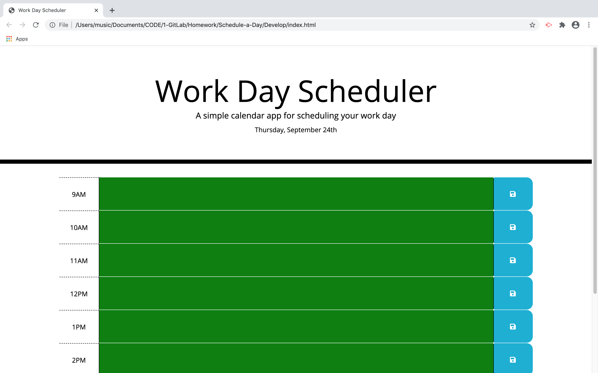

# Schedule-a-Day
JHU Boot Camp Homework 5

Get organized and schedule your day with an hourly planner. Enter notes and events in the appropriate time slot and hit the floppy disc button on the right to save. Stay on task with color coding: gray blocks are in the past, the red block is current,  and green blocks are - no shock here - in the future.

Technologies Used:
- Javascript
- JQUERY
- Moment.js
- HTML
- CSS
- Bootstrap

[Link to external site](https://pindellk.github.io/Schedule-a-Day/)

